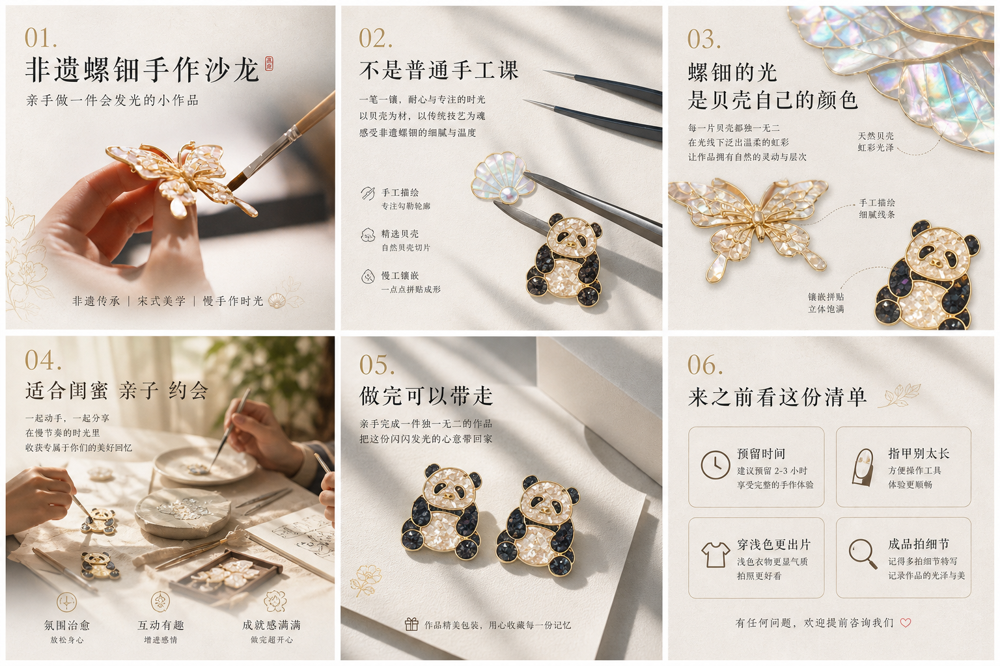
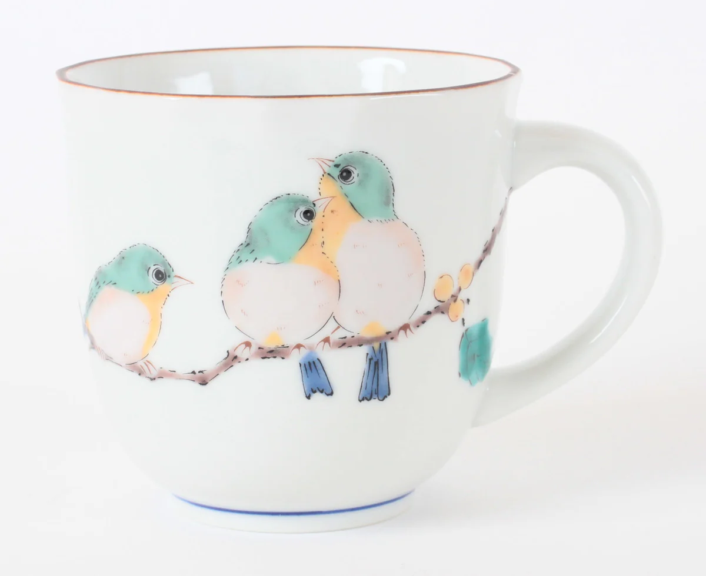
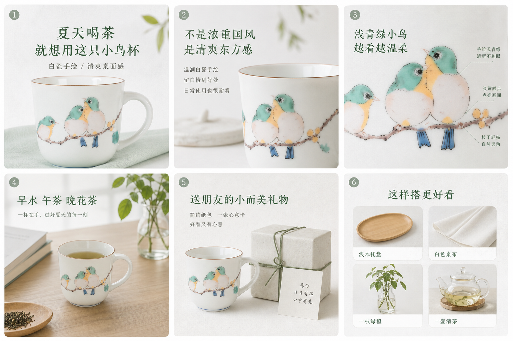
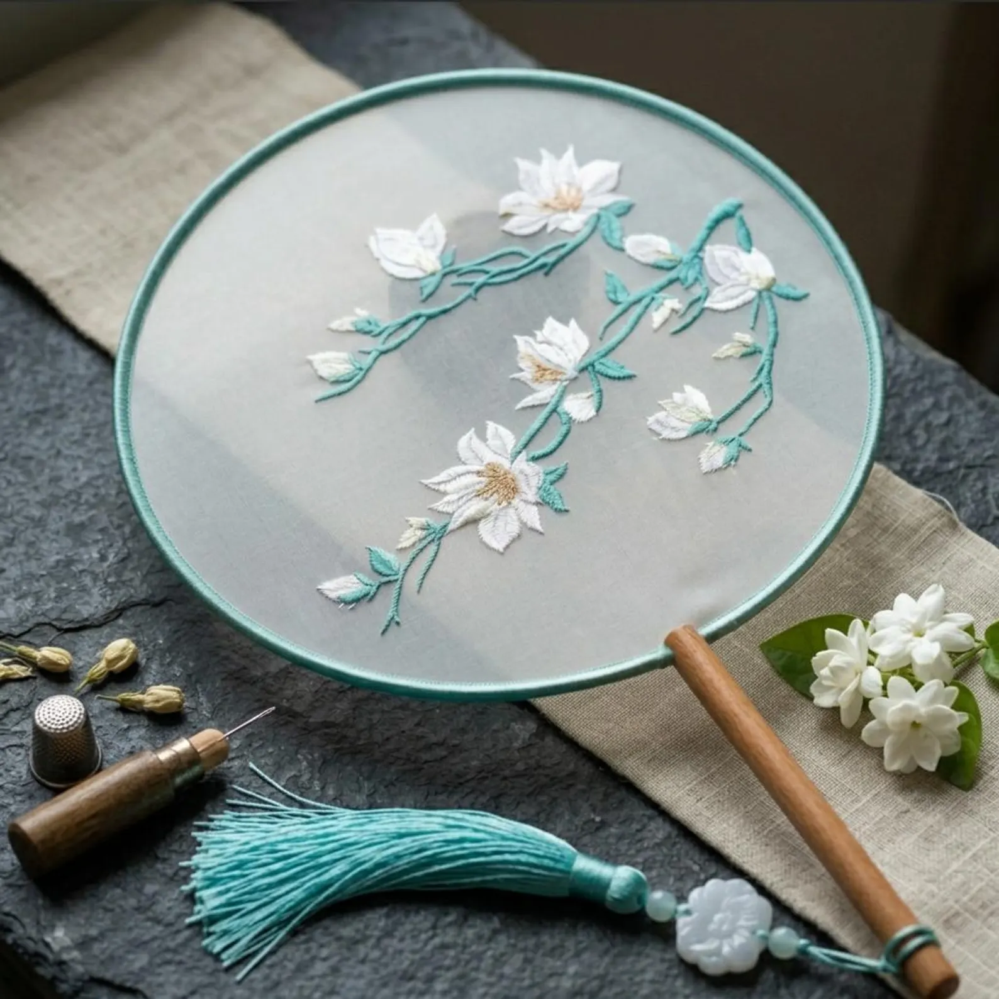
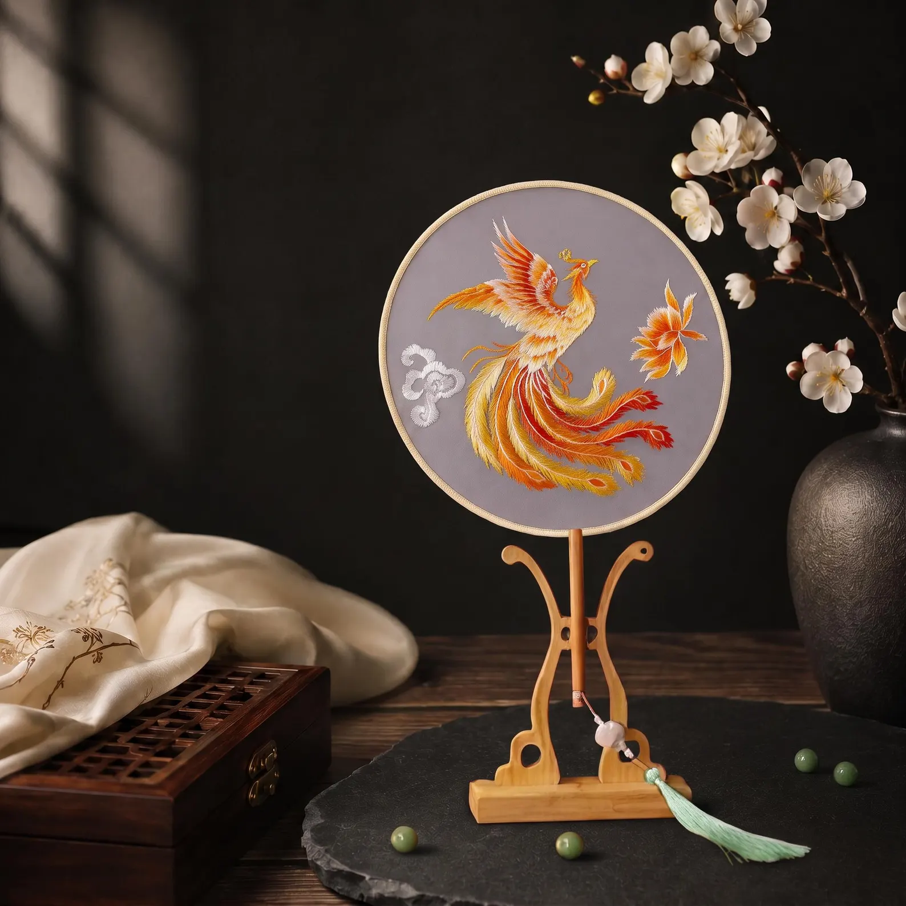
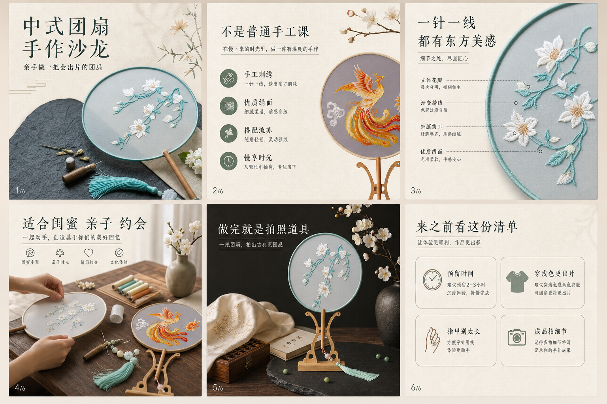

# Chinamax XHS Seeding

中文 | [English](#english)

## 中文

Chinamax XHS Seeding 是一个面向国风商家和文化生活方式品牌的 Codex Skill，用于把普通素材、活动信息或产品信息包装成小红书 / Rednote 种草组图方案。

它适合文旅、博物馆、研学、非遗体验、茶香生活、线香香氛、汉服旅拍、民宿、古镇、文创产品等场景。核心目标不是做泛泛的“古风装饰”，而是帮商家产出可发布、可收藏、能转化的小红书图文内容。

## 能生成什么

- 商家场景判断
- 推荐种草角度
- 推荐国风审美风格
- 3:4 小红书封面标题与构图
- 5-7 页组图结构
- 每页文案
- 素材使用建议
- 可选生图提示词
- 发布正文
- 转化 CTA
- 小红书标签

## 效果示例

### Before / After 对比

这个 skill 会把普通商家素材转化为更适合小红书传播的组图：封面标题更明确、每页逻辑更完整、卖点更贴近消费者、CTA 更自然，整体视觉保持统一的国风审美。


#### 非遗螺钿手作

| 原始素材举例 | 小红书种草组图 |
| --- | --- |
|  |  |

#### 手绘小鸟杯

| 原始素材举例 | 小红书种草组图 |
| --- | --- |
|  |  |


#### 中式团扇手作

| 原始素材举例 | 小红书种草组图 |
| --- | --- |
|  |  |


## 适用场景

- 茶、香、线香、香氛、茶器等东方生活方式产品
- 非遗手作、漆扇、团扇、螺钿、陶艺、竹编、刺绣等体验
- 博物馆、展览、文化街区、城市文化路线
- 亲子研学、暑期活动、亲子手作
- 汉服租赁、妆造、旅拍、城市国风拍摄
- 民宿、园林、古镇、避暑路线
- 文创产品、国风礼物、小众伴手礼

## 审美方向

Skill 会根据商家场景选择一种主视觉风格：

- 唐风华彩
- 宋式留白
- 非遗手作
- 节气东方
- 东方极简

它会避免廉价古风效果，例如随机堆砌龙凤、宫殿、灯笼、祥云、假书法、不可读中文、过度磨皮、过量红金配色等。

## 安装

把本仓库复制到 Codex skills 目录：

```bash
mkdir -p ~/.codex/skills
cp -R chinamax-xhs-seeding ~/.codex/skills/
```

在 Codex 中这样调用：

```text
Use $chinamax-xhs-seeding to package this product or business into a Xiaohongshu seeding carousel.
```

## 目录结构

```text
chinamax-xhs-seeding/
├── SKILL.md
├── README.md
├── agents/
│   └── openai.yaml
├── assets/
│   └── examples/
└── references/
    ├── merchant-scenes.md
    ├── style-system.md
    └── xhs-seeding-layouts.md
```

## 输出结构

Skill 固定输出以下结构：

```markdown
## 商家场景判断
## 推荐种草角度
## 推荐审美风格
## 封面标题
## 封面构图
## 攻略组图
## 每页文案
## 素材使用建议
## 可选生图提示词
## 发布正文
## 转化 CTA
## 小红书标签
```

## 内容边界

- 不编造地址、价格、日期、折扣、奖项、展品事实或预约政策。
- 未提供依据时，不暗示官方授权、专家背书或教育效果承诺。
- 优先使用真实商家素材和可验证信息。
- 只在缺少封面、背景或装饰素材时提供生图提示词。

---

## English

Chinamax XHS Seeding is a Codex Skill for guofeng merchants and Chinese cultural lifestyle brands. It turns ordinary product photos, merchant materials, activity details, or service information into Xiaohongshu / Rednote-ready seeding carousel plans.

It is designed for cultural tourism, museums, study trips, intangible heritage workshops, tea and fragrance products, incense, hanfu photography, guesthouses, ancient towns, and cultural products. The goal is not generic ancient-style decoration, but practical social-commerce content that can be posted, saved, and converted.

## What It Produces

- Merchant scene diagnosis
- Recommended seeding angle
- Recommended guofeng visual style
- 3:4 Xiaohongshu cover title and composition
- 5-7 page carousel structure
- Page-by-page copy
- Real-material usage advice
- Optional image-generation prompts
- Publish-ready caption
- Conversion CTA
- Xiaohongshu hashtags

## Example Output

### Chinese Incense

The example below uses one real product image and packages it into a consumer-facing Xiaohongshu seeding carousel.


### Before / After

The skill turns ordinary merchant materials into Xiaohongshu-ready carousels with clearer cover titles, stronger page-by-page logic, consumer-facing selling points, practical CTAs, and a consistent guofeng visual system.

#### Embroidered Fan Workshop

| Raw Material | Xiaohongshu Carousel |
| --- | --- |
|  |  |

#### Luodian Craft Workshop

| Raw Material | Xiaohongshu Carousel |
| --- | --- |
|  |  |

#### Hand-Painted Bird Cup

| Raw Material | Xiaohongshu Carousel |
| --- | --- |
|  |  |

Additional raw reference material:


## Use Cases

- Tea, incense, fragrance, tea ware, and Chinese lifestyle products
- Intangible heritage workshops such as lacquer fans, embroidered fans, luodian, pottery, bamboo weaving, and embroidery
- Museums, exhibitions, cultural districts, and city culture routes
- Parent-child study trips and seasonal family activities
- Hanfu rental, makeup, photography, and city guofeng shoots
- Guesthouses, gardens, ancient towns, and summer routes
- Cultural products, guofeng gifts, and niche souvenirs

## Visual Directions

The skill chooses one primary visual direction based on the merchant scene:

- Tang Splendor
- Song Literati
- ICH Craft
- Solar Term East
- Eastern Minimal

It avoids cheap ancient-style effects such as random dragons, phoenixes, palace sets, lantern overload, fake calligraphy, unreadable Chinese text, plastic retouching, and excessive red-gold decoration.

## Install

Clone or copy this folder into your Codex skills directory:

```bash
mkdir -p ~/.codex/skills
cp -R chinamax-xhs-seeding ~/.codex/skills/
```

Then invoke it in Codex:

```text
Use $chinamax-xhs-seeding to package this product or business into a Xiaohongshu seeding carousel.
```

## Repository Structure

```text
chinamax-xhs-seeding/
├── SKILL.md
├── README.md
├── agents/
│   └── openai.yaml
├── assets/
│   └── examples/
└── references/
    ├── merchant-scenes.md
    ├── style-system.md
    └── xhs-seeding-layouts.md
```

## Output Contract

The skill always returns this structure:

```markdown
## 商家场景判断
## 推荐种草角度
## 推荐审美风格
## 封面标题
## 封面构图
## 攻略组图
## 每页文案
## 素材使用建议
## 可选生图提示词
## 发布正文
## 转化 CTA
## 小红书标签
```

## Guardrails

- Do not fabricate addresses, prices, dates, discounts, awards, museum facts, or booking policies.
- Do not imply official museum authorization, expert endorsement, or child education outcomes unless provided.
- Prefer real merchant photos and verifiable information over fake AI scenes.
- Use image prompts only for missing covers, backgrounds, or decorative assets.
